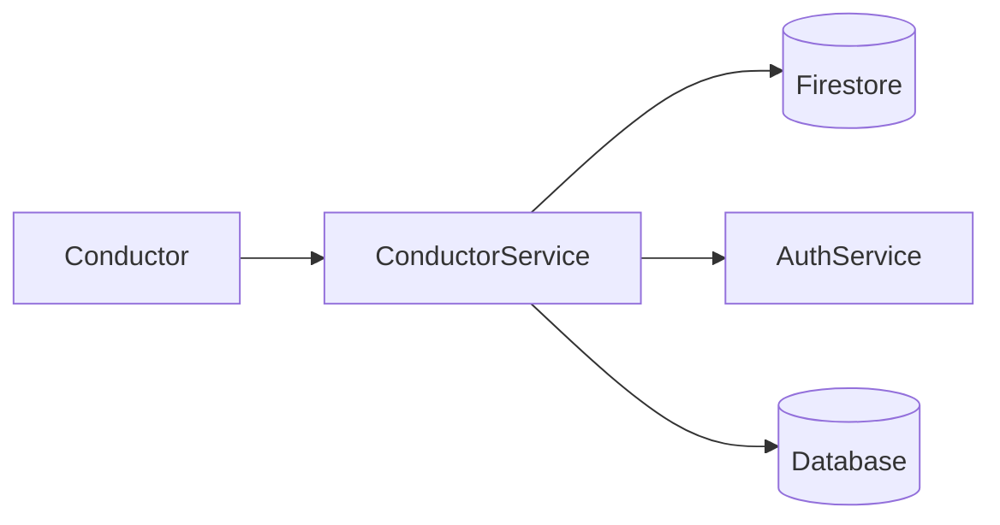

# 🚌 Conductor Service


---

# 📖 Overview

The Conductor Service manages conductor operations within the BusTrackPlus platform.

It allows conductors to initialize bus trips, update current bus stops, issue tickets, retrieve route details, and synchronize live bus information with Firebase. Authentication is performed using JWT tokens issued by the Authentication Service.

---

# ✨ Features

- Conductor Authentication
- Bus Initialization
- Current Stop Management
- Ticket Issuing
- Route Information
- Pass Type Retrieval
- Firebase Integration
- JWT Authorization
- Docker Support

---

# 🏗️ Architecture



---

# 🛠️ Technology Stack

| Technology | Purpose |
|------------|---------|
| Java 21 | Programming Language |
| Spring Boot | Backend Framework |
| Spring Security | JWT Authentication |
| Spring Data JPA | Database Access |
| Firebase Firestore | Live Bus Tracking |
| MySQL | Pass & Ticket Data |
| Docker | Containerization |

---

# 📂 Project Structure

```text
src
├── config
├── controller
├── dto
│   ├── input
│   └── output
├── model
├── repository
└── service
```

---

# 📡 API Endpoints

| Method | Endpoint |
|---------|----------|
| GET | /conductor/status |
| GET | /conductor/validate |
| GET | /conductor/connection |
| GET | /conductor/firebase/status |
| PUT | /conductor/bus/{routeId}/{busNumber}/initialize |
| PUT | /conductor/bus/{routeId}/{busNumber}/current-stop/advance |
| PUT | /conductor/bus/{routeId}/{busNumber}/reset |
| GET | /conductor/bus/{routeId}/{busNumber} |
| GET | /conductor/bus/{routeId}/{busNumber}/exists |
| DELETE | /conductor/bus/{routeId}/{busNumber} |
| GET | /conductor/route/{routeId} |
| POST | /conductor/bus/{routeId}/{busNumber}/issue-ticket |
| GET | /conductor/payment-methods |
| GET | /conductor/pass-types |

---

# 🐳 Docker

The Conductor Service runs as part of the **BusTrackPlus Infrastructure** using Docker Compose.

**Default Port**

```
8083
```

---

# 🚀 Running the Project

Clone the repository.

```bash
git clone <repository-url>
```

Build the project.

```bash
mvn clean install
```

Run locally.

```bash
mvn spring-boot:run
```

Or run with Docker.

```bash
docker compose up --build
```

---

# 🚀 Future Improvements

- QR Code Ticket Validation
- Offline Ticket Synchronization
- Live Passenger Count
- GPS Integration
- Digital Receipt Generation
- Real-Time Analytics Dashboard

---

# 📄 License

This project is intended for educational and portfolio purposes.

Copyright © 2026 Rishi Panneerselvam.